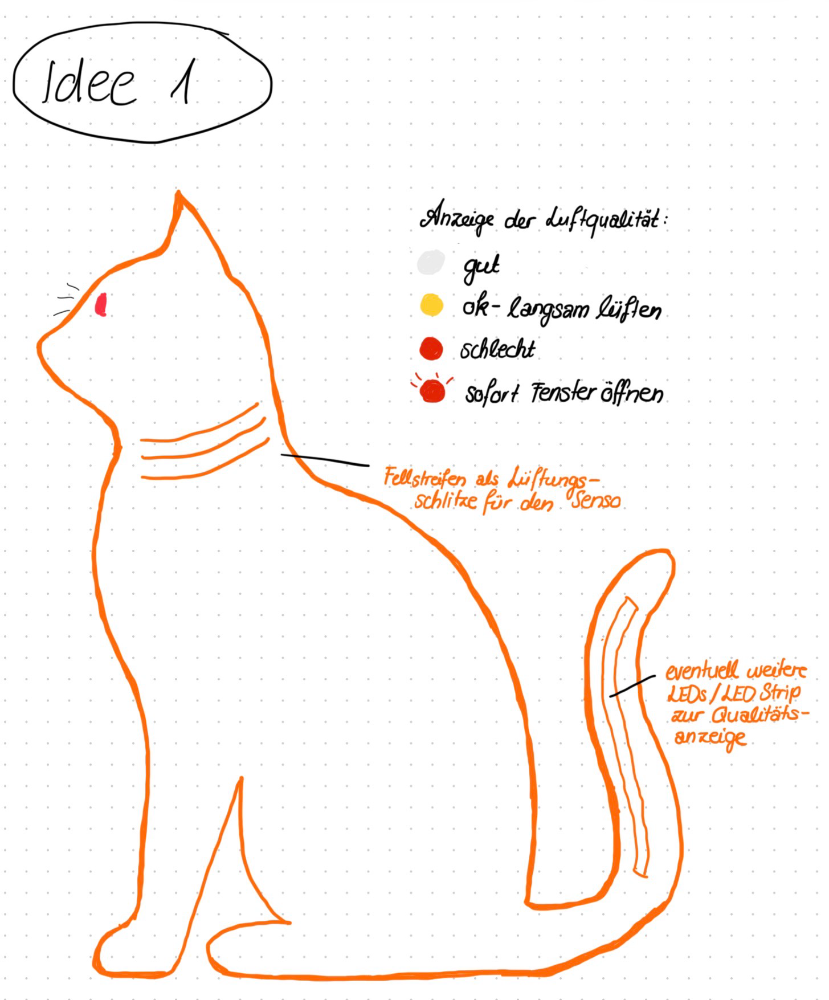
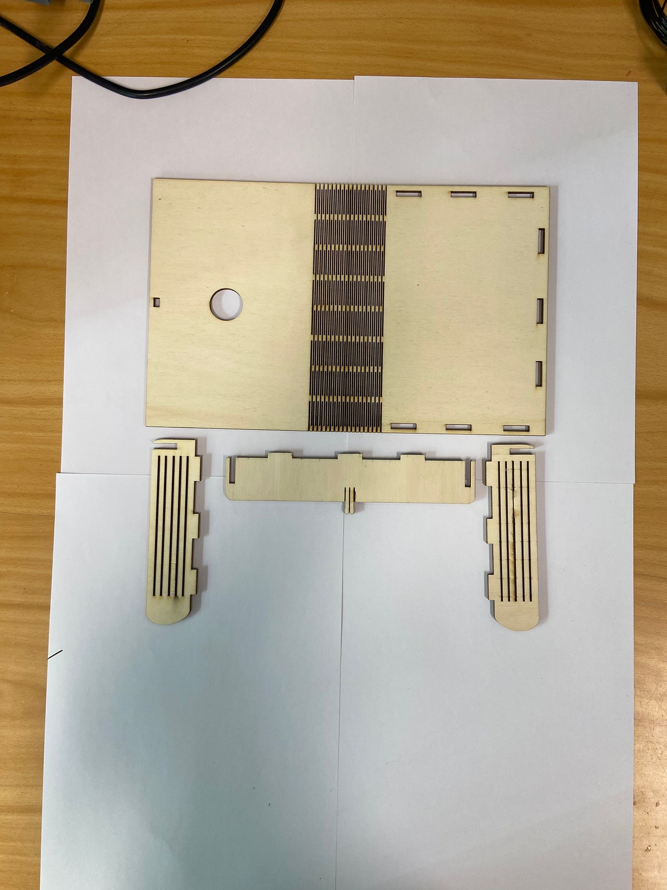
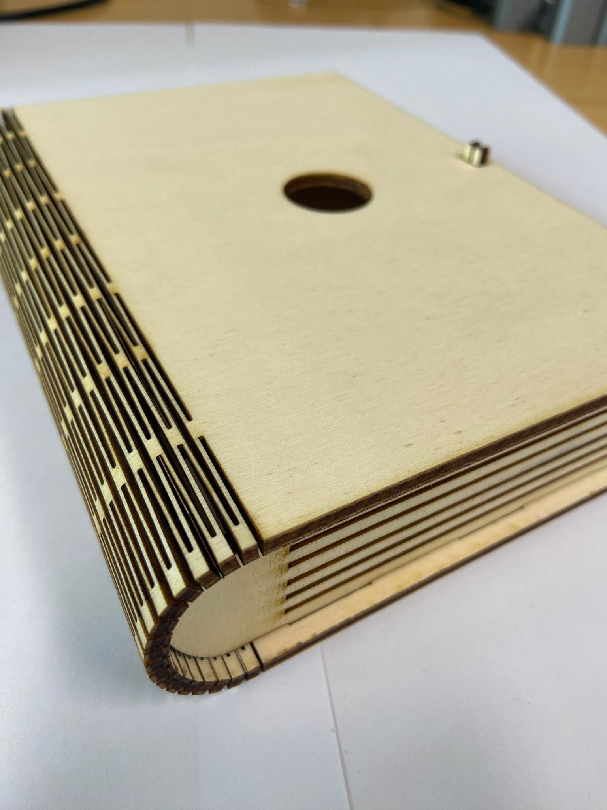
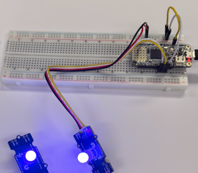

# AQCat


AQCat is a cat-shaped air quality monitoring system that measures environmental conditions in real time. It collects sensor data such as temperature, humidity, and CO2, providing users with a simple and engaging way to monitor their surroundings. 

The device uses color-coded LEDs to provide an intuitive visual indication of current air quality and ventilation needs:

🔵 Blue: Air quality is good.

🟡 Yellow: Air quality is moderate and should be monitored.

🔴 Red: Air quality is poor and ventilation is recommended.


## Inspiration

During the PHYCOM block module at FHNW, we spent many hours in a classroom on the 5th floor, where indoor temperatures often exceeded 32°C. As the day progressed, the air quality would noticeably deteriorate, making the room uncomfortable and reducing concentration. However, it was not always obvious when ventilation was actually needed.

 


We wanted to create a simple and intuitive way to indicate when it was time to open a window and bring in fresh air. Since we both love cats, we decided to combine this idea with a playful design and build the device in the shape of a cat.


Meet Gorgi and Paco, our beloved cats and the inspiration behind AQCat.

## Build Instructions
Follow these steps to build your own AQCat.



### Electronics


- Microcontroller (We used Adafruit Feather M4 Express)
- SCD30 CO₂, temperature and humidity sensor
- NeoPixel LED strip with 10 LEDs
- Chainable RGB LED module with 2 LEDs for the cat eyes
- Jumper wires
- USB cable for programming and power supply

### Enclosure
The AQCat enclosure is made from laser-cut wood and designed in the shape of a cat. In addition to the cat-shaped front, we needed a practical way to house the electronics while keeping them accessible for maintenance and future modifications. We therefore designed a laser-cut enclosure inspired by a book.

  
   
### Software Setup

1. Clone the repository:

```bash
git clone https://github.com/miranicad/AQCat.git
```

2. Open the project in the Arduino IDE.

3. Install the required libraries:

    * Adafruit SCD30
    * Adafruit NeoPixel
    * ChainableLED

4. Connect the Adafruit Feather M4 Express via USB.

5. Select the correct board and port.

6. Upload the firmware to the microcontroller.

### System Overview


The SCD30 sensor continuously measures:

- CO₂ concentration (ppm)
- Temperature (°C)
- Relative humidity (%)

Based on the measured CO₂ concentration, AQCat displays the current air quality using LEDs:

| CO₂ Level      | Status | Color |
|----------------|---------|--------|
| x < 800 ppm    | Good air quality | 🔵 Blue |
| 800 - 1000 ppm | Ventilation recommended soon | 🟡 Yellow |
| x > 1000 ppm   | Ventilate immediately | 🔴 Red |


When the CO₂ concentration exceeds 1000 ppm, AQCat triggers a visual alert by illuminating the LED strip in red and flashing the cat's eyes.


## Conclusion

AQCat was created to make air quality monitoring simple, accessible, and fun. By combining sensor technology with a cat-inspired design, we transformed an everyday problem into an engaging solution.

We hope AQCat encourages people to pay more attention to their indoor environment—and perhaps inspires a few more cat-themed engineering projects along the way. 🐱
